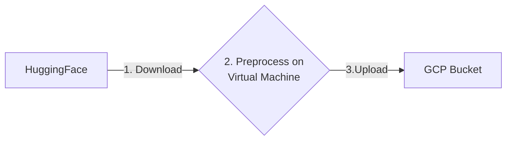
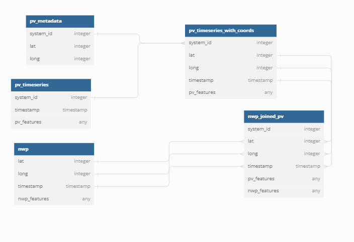

# Datapipeline
Here is what the updated pipeline would do.

## Step 1: Downloading
This step can be done using the `NWPPipeline.download` method. All we need to do is specify a path.
## Step 2: Preprocessing
This is where the bulk of work is done. In this step the data is preprocessed and wrangled. Here are most of the steps needed to transform the raw HuggingFace data into cleaned model ready data:
1.	Cropping region
2.	Cropping time
3.	Dropping unwanted features
4.	Interpolate (optional)
6.	Join PV

The process of joining NWP and PV is done using a SQL like join. Here is a diagram explaining the schema.

## Step 3: Upload
This step is easy, we already have scripts to upload a directory from local to a GCP bucket.